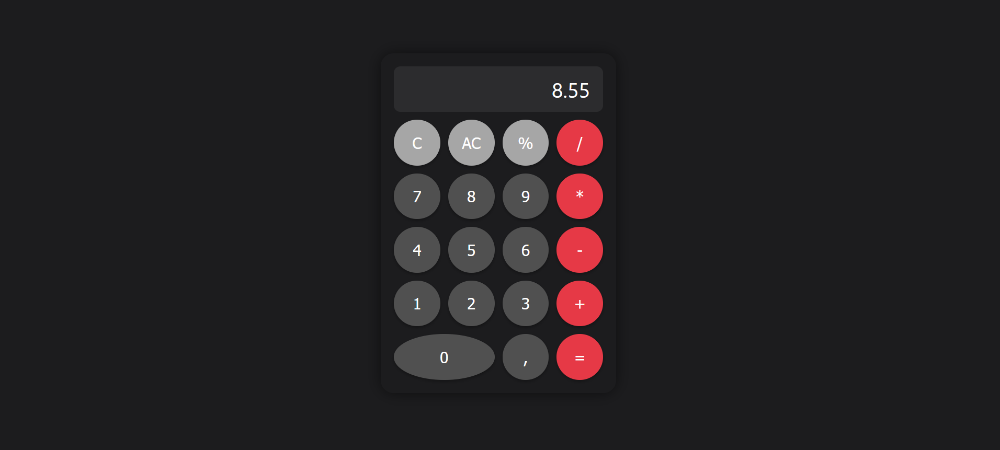

# Simple Calculator

A simple, responsive calculator built with **HTML**, **CSS**, and **JavaScript**.

## Features

- Basic arithmetic operations: addition, subtraction, multiplication, division
- Percentage calculation
- Clear last entry (C) and all clear (AC)
- Decimal support
- Responsive design for mobile and desktop
- Stylish dark theme with hover and click effects

## Preview



## Live Demo

Check out the live demo on GitHub Pages:  
[Simple Calculator Demo](https://Mitii146.github.io/simple-calculator/)

## Usage

1. Clone the repository:

```bash
git clone https://github.com/TwojLogin/simple-calculator.git
```

2. Open index.html in your browser.
3. Start calculating!

## How it works

- Click numbers to input values.
- Click operators (+, -, \*, /) to choose an operation.
- Click = to calculate the result.
- Use C to delete the last digit.
- Use AC to reset the calculator.
- Use % to calculate percentages.

## Technologies Used

- HTML5
- CSS3 (Grid layout, responsive design)
- Vanilla JavaScript

## License

This project is open-source under the MIT License.
